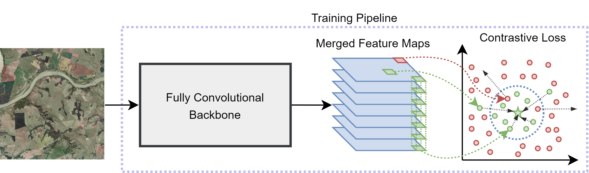
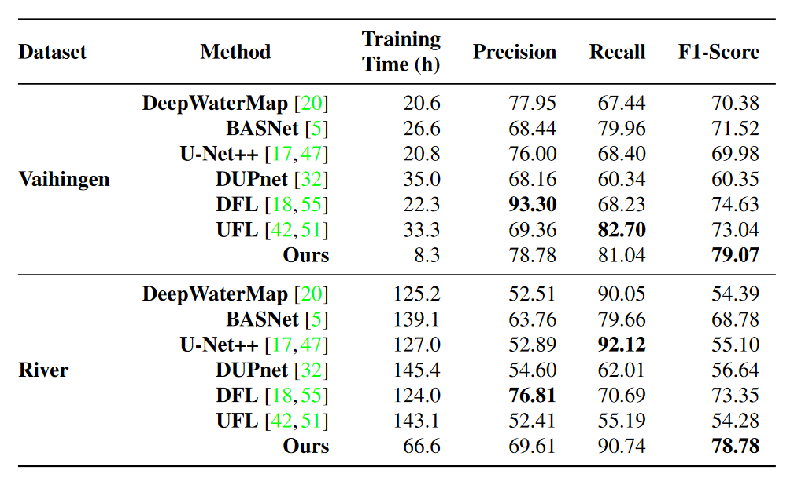

# Prototypical Contrastive Network for Imbalanced Aerial Image Segmentation (WACV 2024)



Binary segmentation is the main task underpinning several remote sensing applications, which are particularly interested in identifying and monitoring a specific category/object. Although extremely important, such a task has several challenges, including huge intra-class variance for the background and data imbalance. Furthermore, most works tackling this task partially or completely ignore one or both of these challenges and their developments. In this paper, we propose a novel method to perform imbalanced binary segmentation of remote sensing images based on deep networks, prototypes, and contrastive loss. The proposed approach allows the model to focus on learning the foreground class while alleviating the class imbalance problem by allowing it to concentrate on the most difficult background examples. The results demonstrate that the proposed method outperforms state-of-the-art techniques for imbalanced binary segmentation of remote sensing images while taking much less training time.

## Installation and requirements

This project uses PyTorch 2.0. All necessary packages can be found in the requirements.txt.

## Usage

```
python main.py --operation [Train | Test] 
               --dataset [River | Vaihingen]
               --dataset_path PATH_TO_DATASET 
               --training_images IMAGES_USED_FOR_TRAIN 
               --testing_images IMAGES_USED_FOR_TEST_VAL
               --crop_size SIZE_OF_CROP_IMAGE 
               --stride_crop SIZE_OF_STRIDE_CROP 
               --batch_size BATCH_SIZE 
               --output_path OUTPUT_PATH 
               --model MODEL 
               --epoch_num EPOCH_NUM 
               --margin MARGIN_SIZE
               --miner [True | False] 
```

### Training

Example script for training a FCN-DenseNet121 model on the Vaihingen dataset.

```
python main.py --operation Train 
               --dataset Vaihingen 
               --dataset_path /home/datasets/vaihingen/ 
               --training_images 1 3 5 
               --testing_images 11 15 
               --crop_size 128 
               --stride_crop 64 
               --batch_size 16 
               --output_path output/ 
               --model DenseNet121 
               --epoch_num 200 
               --margin 3 
               --miner True 
```

### Inference

Example script to perform inference on the Vaihingen dataset.
Observe that, in this case, the trained model must be in the output_path folder.

```
python main.py --operation Test 
               --dataset Vaihingen 
               --dataset_path /home/datasets/vaihingen/ 
               --training_images 1 3 5 
               --testing_images 11 15 
               --crop_size 128 
               --stride_crop 64 
               --batch_size 16 
               --output_path output/ 
               --model DenseNet121 
               --margin 3 
               --miner True 
```

## Model

Download the trained FCN-DenseNet121 model for the Vaihingen dataset here.

## Results



## Citing

If you use this code in your research, please consider citing:

    @inproceedings{nogueira2024prototypical,
      title={Prototypical Contrastive Network for Imbalanced Aerial Image Segmentation},
      author={Nogueira, Keiller and Faita-Pinheiro, Mayara Maezano and Ramos, Ana Paula Marques and Gon{\c{c}}alves, Wesley Nunes and Junior, Jos{\'e} Marcato and Dos Santos, Jefersson A},
      booktitle={Proceedings of the IEEE/CVF Winter Conference on Applications of Computer Vision},
      pages={8366--8376},
      year={2024}
    }
